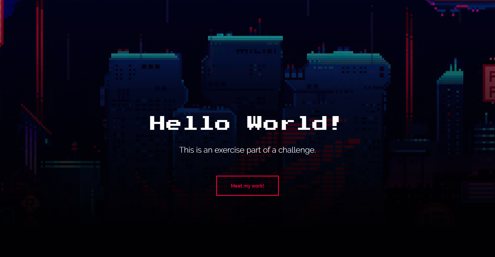

# Hello World! - 21 Days Coding

> Dia 1 e 2

Projeto desenvoldido para o "21 dias de código" da Rocketseat. Dia 1: Hello World com fonte estilizada e imagem de fundo. Dia 2: Um botão animado.

[🔗 Clique aqui para acessar!](https://jotalimas.github.io/21days-coding/)

## 🛠 Tecnologias

- HMTL
- CSS
- Git e Github